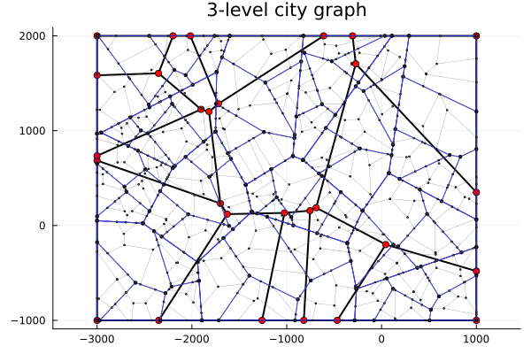

# Synthetic Cities

This repository is an implementation of a Voronoi-based generator of graphs that represent city road networks. The graph consists of nodes (intersections) and edges (road segments).

## Construction

The generator constructs a **three-level hierarchical graph** using recursive Voronoi subdivision:

1. **Level 1** — A coarse city partition over a bounding box, defined by input nodes and edges
2. **Level 2** — Subdivision of each level-1 polygon using Sobol quasi-random sampling
3. **Level 3** — Further subdivision of level-2 polygons using uniform random sampling

At each level, seed points are sampled inside polygons, a Voronoi diagram is computed and clipped to the polygon boundary, and the dual graph (nodes + edges) is extracted.


```julia
using Graphs
using OpenStreetMapX
using CSV
using DataFrames
using Plots
using Graphs
using Statistics
include("voronoi_graph.jl")
using .voronoi_graph
```

# Level 1


```julia
bounds = voronoi_graph.Bounds(-3000.0, 1000.0, -1000.0, 2000.0)
start = voronoi_graph.generate_start_sample(13, bounds)
vorn_diagram = voronoi_graph.generate_rect_vorn_diagram(start, bounds)
gs, ndes, edge_lst, polys = voronoi_graph.extract_graph(vorn_diagram)
nodes_level_1 = ndes
edges_level_1 = edge_lst

```


    40-element Vector{Tuple{Int64, Int64}}:
     (23, 28)
     (3, 25)
     (1, 2)
     (23, 24)
     (1, 24)
     (8, 15)
     (9, 10)
     (10, 11)
     (16, 20)
     (1, 4)
     ⋮
     (16, 17)
     (5, 8)
     (13, 14)
     (19, 22)
     (22, 23)
     (17, 26)
     (6, 7)
     (17, 18)
     (24, 28)


# Level 2


```julia
nodes_level_2 = []
edges_level_2 = []
polys_2 = []
for poly in values(polys)
    coords = Vector{Tuple{Float64,Float64}}(collect(poly))
    smpl = voronoi_graph.generate_sample(5, coords, type=:sobol, oversample=2)
    vorn2 = voronoi_graph.generate_vorn_diagram(smpl, coords)
    g2, n2, e2, p2 = voronoi_graph.extract_graph(vorn2)
    push!(nodes_level_2, n2)
    push!(edges_level_2, e2)
    push!(polys_2, p2)
end
```

# Level 3


```julia
third_polys = [poly for d in polys_2 for poly in values(d)]
nodes_level_3 = []
edges_level_3 = []
for poly in third_polys
    coords = Vector{Tuple{Float64,Float64}}(collect(poly))
    smpl = voronoi_graph.generate_sample(5, coords, type=:uniform, oversample=2)
    vorn3 = voronoi_graph.generate_vorn_diagram(smpl, coords)
    g3, n3, e3, p3 = voronoi_graph.extract_graph(vorn3)
    push!(nodes_level_3, n3)
    push!(edges_level_3, e3)
end
```


```julia
function plot_graph(nodes, edges; color=:black, lw=0.5, ms=2, mc=:red, p=nothing)
    p = isnothing(p) ? plot(aspect_ratio=:equal, legend=false) : p
    for (u, v) in edges
        plot!(p, [nodes[u][1], nodes[v][1]], [nodes[u][2], nodes[v][2]],
              color=color, linewidth=lw)
    end
    scatter!(p, first.(nodes), last.(nodes), markersize=ms, color=mc)
    return p
end

p = plot(aspect_ratio=:equal, legend=false, title="3-level city graph")
plot_graph(nodes_level_1, edges_level_1; color=:black, lw=2, ms=4, mc=:red, p=p)
for (n, e) in zip(nodes_level_2, edges_level_2)
    plot_graph(n, e; color=:blue, lw=1, ms=2, mc=:blue, p=p)
end
for (n, e) in zip(nodes_level_3, edges_level_3)
    plot_graph(n, e; color=:gray, lw=0.3, ms=1, mc=:gray, p=p)
end
savefig(p, "city_graph.png")
```


